<picture>
  <source media="(prefers-color-scheme: dark)" srcset=".github/assets/hero-dark.svg">
  
</picture>

 

I'm Tamas. I build for the web, mostly front-end, and digital design is the part
I actually care about. When I'm not on a layout I'm shooting photos.

🇷🇺 &nbsp;🇫🇷 &nbsp;🇭🇺

**[landesz.dev](https://landesz.dev)** is my portfolio, still in development.
**[atomifys.com](https://atomifys.com)** is the web studio I'm starting, also a work in progress.
I gave a **[TEDx talk on predatory algorithms](https://www.youtube.com/watch?v=Maygx-Y7VcA)**.

 

<picture>
  <source media="(prefers-color-scheme: dark)" srcset=".github/assets/stack-dark.svg">
  
</picture>

 

### Open to inquiries

[**tom@landesz.dev**](mailto:tom@landesz.dev) &nbsp;·&nbsp; [landesz.dev](https://landesz.dev) &nbsp;·&nbsp; [atomifys.com](https://atomifys.com)
